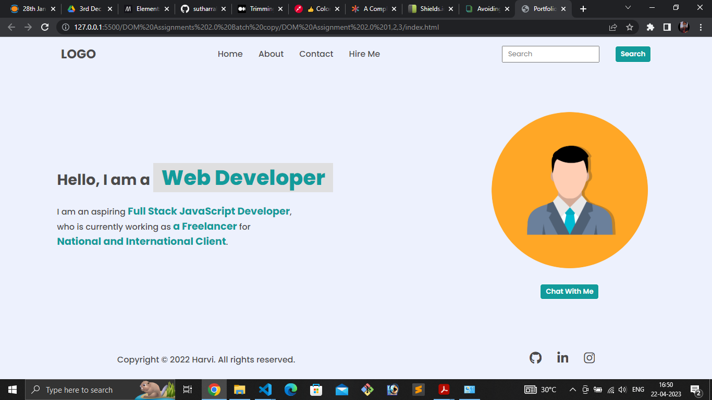

# DOM Assignment
**Task 1** <br>
Add hire me


``` Javascript
let elul = document.createElement("li");
      elul.innerHTML= "<a>Hire Me </a>";
     let element = document.querySelector("header nav ul");
     element.appendChild(elul)
```

---

**Task 2** <br>
Replace placeholder name Search to Search My project

``` Javascript
 document.querySelector("header nav .search-field input ").placeholder ="Search My Project";
```

----

**Task 3**<br>
Replce paragraph text  

``` Javascript
           const span = document.querySelectorAll(".hero-section .hero-left-section p span");
      for(let i=1; i<3; i++){
        const content = span[i];
        if(i == 1){
          content.textContent="an Employee"
        }
        else if(i == 2){
          content.textContent="iNeuron Intelligence Pvt Ltd."
        }
      }
```

**Task 4**<br>
Replace photo

```Javascript
document.querySelector(".hero-right-section img").src = "hitesh sir.png"
```
---

**Task 4**<br>
Add New button 'Support Me'

```Javascript
let btn = document.createElement("button");
     btn.innerText = "Support Me";
     let element = document.querySelector(".hero-right-section-btns");
     element.appendChild(btn);
```

## SecondAssignmentImage
**Task 1**<br>
Chagebackground color of Heading

``` Javascript
const listOfAllH3Tags = document.querySelectorAll(".accordian-wrapper .accordian h3")
        for(let i=0 ;i<listOfAllH3Tags.length; i++){
          const H3 = listOfAllH3Tags[i];
          H3.style.backgroundColor = "#dadaf8"
        }
```

---
**Task 2** <br>
Add skills and more.

```Javascript
 const elm = document.querySelector(".accordian-wrapper");
        const newelement = document.createElement("div");
        newelement.className = "accordian";
        const newel = document.createElement("h3");
        newel.innerText= "Skills";
        const pele = document.createElement("p");
        pele.innerText = "I posses a very good command over the Full Stack Development technologies like MERN can be see in my work over the Github";

        
        elm.append(newelement);
        newelement.append(newel, pele);
```

---

## ThirdAssignmentImage
**Task 1**
Change placeholder

```Javascript
document.querySelector(".enterName").placeholder = "FSJS 2.0";
document.querySelector(".enterMail").placeholder = "fsjs@ineuron.ai";
document.querySelector(".enterMessage").placeholder ="Hello world";
document.querySelector(".userName").placeholder = "FSJS 2.0";
document.querySelector(".userEmail").placeholder = "fsjs@ineuron.ai";
document.querySelector(".userMessage").placeholder ="Hello world";
```