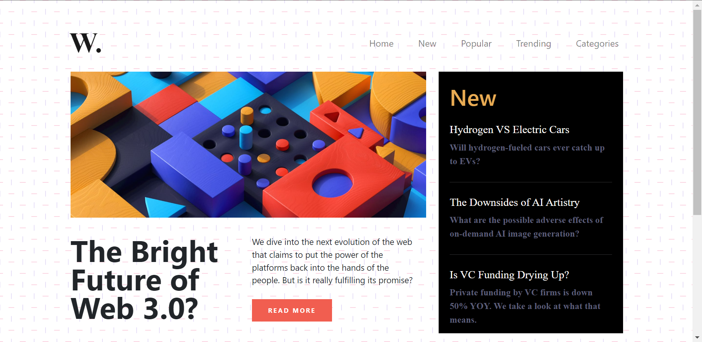

# Task 1


# Task 2
**Before**
<br>
**After**
```Javascript
      document.body.style.backgroundImage = "none";

```


# Task 3
**Before**

**After**
```Javascript
      function toggler(){
        const toggle = document.querySelector(".collapse");
        if (toggle.style.display === "none") {
            toggle.style.display = "flex";
        } else {
          toggle.style.display = "none";
        }
      }
      document.querySelector(".navbar-toggler").addEventListener("click",toggler);

```
